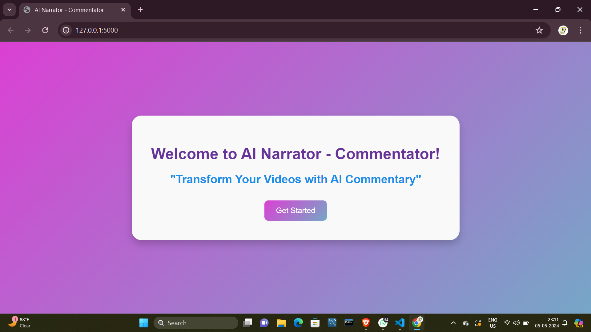
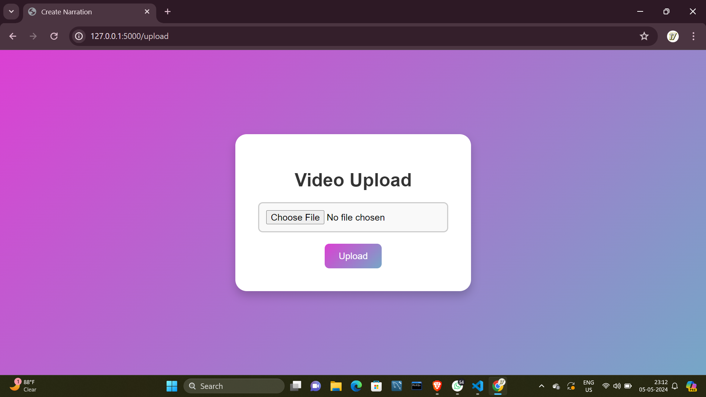
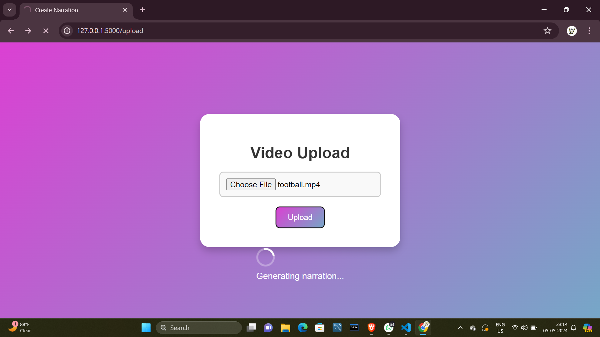
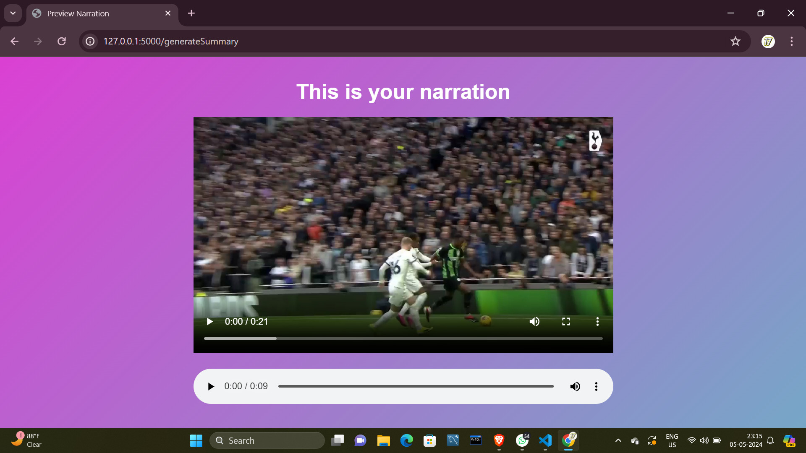

# AI Narrator

AI Narrator is a project that generates voiceover scripts for videos using AI models and converts these scripts into audio files. This project aims to automate the process of creating voiceovers for videos, particularly useful for scenarios like narrating sports highlights or educational content.

## Screenshots

Here are some screenshots of different pages in the application:

1. **Homepage**
   

2. **Upload Page**
   

3. **Generating Narration**
   

4. **Result Page**
   

## Result Video


https://github.com/maheshsathe07/AI-Narrator/assets/123986496/30a0e04c-7e2c-4aa7-9602-a11655169d57


## Table of Contents

- [Installation](#installation)
- [Usage](#usage)
- [License](#license)

## Installation

1. Clone the repository:

    ```bash
    git clone https://github.com/maheshsathe07/AI-Narrator.git
    cd ai-narrator
    ```

2. Install the required dependencies:

    ```bash
    pip install -r requirements.txt
    ```

3. Obtain API Keys:

    - **Gemini API Key**: Obtain your Gemini API key and add it to the `config.json` file under `"gemini_api_key"`.
    - **Audiostack API Key**: Obtain your Audiostack API key and add it to the `config.json` file under `"audiostack_api_key"`.

## Usage

1. Convert Video to Base64 Frames:

    ```python
    base64_frames = video_to_base64(video_path)
    ```

2. Generate Script Using Gemini:

    ```python
    script = generate_script_gemini(base64_frames)
    ```

3. Generate Audio Using Audiostack:

    ```python
    audio_path = generate_audio(script)
    ```

4. Add Voiceover to Video:

    ```python
    add_voiceover(audio_path, video_path)
    ```

## License

This project is licensed under the MIT License - see the [LICENSE](LICENSE) file for details.
